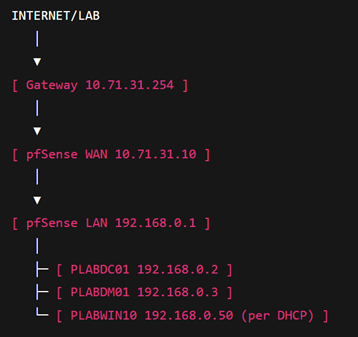

# Erstes LAB

### Kurze Beschreibung:

Es soll eine echte Arbeitsumgebung geschaffen werden, dafür starten wir erstmal mit der Konfiguration der Firewall PFSENSE als virtuelle Maschine
auf einem Windows Server 2025 über HYPER-V

Als zweites erstellen wir über Hyper-V einen virtuellen Windows Server 2025 namens PLABDC01 und werten diesen zu einem Domaincontroller auf.

Als drittes erstellen wir über Hyper-V einen zweiten virtuellen Windows Server 2025 PLABDM01 und treten mit diesem unserer Domain von DC01 bei.

Als viertes erstellen wir über Hyper-V einen Windows 11 Client und treten mit diesem auch der Domain von DC01 bei und IP soll per DHCP bezogen werden.

Firewall Regeln sollen manuell konfiguriert werden, um die Schwierigkeit zu erhöhen.

  

## Firewall Konfiguration:

Als erstes gehen wir auf PFSENSE und forden einmal die kostenlose Version der Firewall an und laden diese herunter.

Als nächstes laden wir 7ZIP herunter und entpacken die heruntergeladene Datei, wir benötigt damit wir eine ISO bekommen, die wir benutzen können.

Danach erstellen wir einen privaten virtuellen Switch (LAN) in den Hyper-V Einstellungen.

Dann erstellen wir die virtuelle Maschine (Firewall) mit der PFSENSE ISO und fügen unter Einstellungen den Netzwerkadapter LAN hinzu,
deaktivieren Secure boot und starten die virtuelle Maschine.

Dann Standard Einstellungen durchgehen.

  

Hier sieht man einmal wie unserer Aufbau im LAB sein sollte Gateway 10.71.31.254 von unserer Testumgebung, unsere pfSense WAN IP-Addresse
mit 10.71.31.10.

Danach konfigurieren wir unser eigenes LAN mit pfSense IP-Adresse 192.168.0.1, statischer IP-Addresse PLABDC01 mit 192.168.0.2, 
statischer IP-Addresse 192.168.0.3 von PLABDM01 und dann wird später ber DHCP für PLABWIN10 eine IP Adresse per DHCP hinzugefügt.
(Später im LAB über DHCP)

  

### WAN Interface Konfiguration:

Option 2 | deaktivieren DHCP | Legen Firewall WAN IP auf 10.71.31.10 | Gateway auf 10.71.31.254.

Dabei wählen wir bei der Firewall die Option 2 Set interface IP-Address aus und gehen die Einstellungen wie oben beschrieben durch.

  

### LAN Interface Konfiguration:

Option 2 | DHCP deaktivieren| IP-Adresse auf 192.168.0.1 setzen | kein Gateway | DHCP auf LAN deaktivieren.

Dabei wählen wir bei der Firewall die Option 2 Set interface IP-Address aus und gehen die Einstellungen wie oben beschrieben durch.

  

### Firewall Web-Interface

Option 3 | Option 3 um Passwort zu setzen und dann admin + Passwort.

Firewall kann unter https://192.168.0.1 geöffnet werden + einloggen.

Da Bild sehr schlecht ist Firewall | Rules | Lan | Add

Action: Pass | Interface: Lan | Address Family IPv4 | Protocol: any | Source: LAN net: 192.168.0.0/24| Destination: any | Save

Unter System | Routing | Gateways schauen das wir nur ein Interface haben.

  

### PLABDC01 Konfiguration:

Standardinstallation Windows Server 2025 | Windows Updates | Namen ändern | IE ausschalten | Remotedesktop aktivieren | Zeit anpassen | Neustart

Über Windows Feature | Active Directory-Domänendienste installieren mit Domain Name: Plab.de (in dem LAB wird über Gateway 10.71.41.254 DC01 installieren) | herunterfahren

PLABDC01 Settings | Netzwerkadapter auf virtuellen Switch LAN (davor WAN) abändern.

In Etherneteinstellungen IP: auf 192.168.02 | 255.255.255.0 | Gateway:192.168.0.1 | DNS:192.168.0.2 setzen 

DHCP auf DC01 installieren und dort Plab_Scope einstellen | Von 192.168.0.1 – 255 | Ausschluss .1 und .2 | Gateway auf 192.168.0.1 und DNS auf .2 setzen

  

### PLABDM01 Konfiguration:

PLABDC01 Settings | Netzwerkadapter auf virtuellen Switch LAN (davor WAN) abändern.

Standardinstallation Windows Server 2025 | Windows Updates | Namen ändern | IE ausschalten | Remotedesktop aktivieren | Zeit anpassen | Neustart

In Etherneteinstellungen IP: auf 192.168.04 | 255.255.255.0 | Gateway:192.168.0.1 | DNS:192.168.0.2 setzen 

Domain Plab.de beitreten

  

### PLABWIN11:

PLABDC01 Settings | Netzwerkadapter auf virtuellen Switch LAN (davor WAN) abändern.

Standardinstallation | IP automatisch | Domain beitreten

  

## Abschluss:

Das LAB wurde erfolgreich abgeschlossen, alle Geräte haben IPS im neuen Netzwerk (LAN) und wir haben einen DHCP Server erfolgreich installiert.

