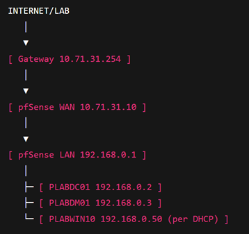
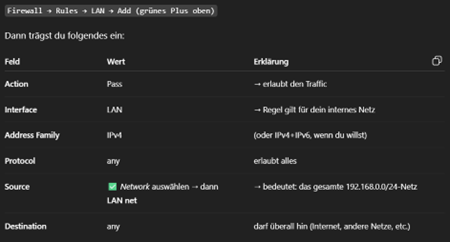

# Lab 1 - Windows-Testumgebung mit pfSense-Firewall


## Ziel

Aufbau einer virtuellen Testumgebung mit pfSense, Windows Server 2025, Active Directory, DHCP und einem Windows-11-Client.

## Umgebung

| System | Rolle | IP-Adresse |
| --- | --- | --- |
| pfSense | Firewall und Gateway | WAN: `10.71.31.10`, LAN: `192.168.0.1` |
| PLABDC01 | Domain Controller, DNS, DHCP | `192.168.0.2` |
| PLABDM01 | Member Server | `192.168.0.3` |
| PLABWIN11 | Windows-11-Client | DHCP |

## Aufbau



Die Umgebung wird in Hyper-V aufgebaut. pfSense trennt das externe WAN-Netz vom internen LAN. Die Firewall-Regeln werden bewusst manuell gesetzt, um das Verhalten von pfSense besser zu verstehen.

## pfSense vorbereiten

1. pfSense Community Edition herunterladen.
2. ISO mit 7-Zip entpacken, falls erforderlich.
3. In Hyper-V einen privaten virtuellen Switch für das LAN erstellen.
4. pfSense-VM erstellen, ISO einbinden und Secure Boot deaktivieren.
5. WAN- und LAN-Adapter zuweisen.

## Interface-Konfiguration

### WAN

- Option: `2 - Set interface IP address`
- DHCP deaktivieren
- IP-Adresse: `10.71.31.10/24`
- Gateway: `10.71.31.254`

### LAN

- Option: `2 - Set interface IP address`
- DHCP deaktivieren
- IP-Adresse: `192.168.0.1/24`
- Gateway: keiner

## Firewall-Regel



Pfad: `Firewall > Rules > LAN > Add`

| Feld | Wert |
| --- | --- |
| Action | Pass |
| Interface | LAN |
| Address Family | IPv4 |
| Protocol | any |
| Source | LAN net `192.168.0.0/24` |
| Destination | any |

Zusätzlich unter `System > Routing > Gateways` prüfen, dass nur das gewünschte Gateway aktiv ist.

## PLABDC01 konfigurieren

1. Windows Server 2025 installieren.
2. Windows Updates installieren.
3. Servernamen setzen.
4. Remotedesktop aktivieren.
5. Netzwerkkarte auf den LAN-Switch umstellen.
6. Statische IP-Adresse konfigurieren:

```text
IP:      192.168.0.2
Maske:   255.255.255.0
Gateway: 192.168.0.1
DNS:     192.168.0.2
```

7. Active Directory-Domänendienste installieren.
8. Domäne `Plab.de` erstellen.
9. DHCP-Rolle installieren und Scope konfigurieren.

## PLABDM01 konfigurieren

1. Windows Server 2025 installieren.
2. Netzwerkkarte auf den LAN-Switch umstellen.
3. Statische IP-Adresse konfigurieren:

```text
IP:      192.168.0.3
Maske:   255.255.255.0
Gateway: 192.168.0.1
DNS:     192.168.0.2
```

4. Server der Domäne `Plab.de` beitreten lassen.

## PLABWIN11 konfigurieren

1. Windows 11 installieren.
2. Netzwerkkarte auf den LAN-Switch umstellen.
3. IP-Adresse per DHCP beziehen.
4. Client der Domäne `Plab.de` beitreten lassen.

## Ergebnis

Die Testumgebung wurde erfolgreich aufgebaut. Alle Systeme befinden sich im internen LAN, der DHCP-Server verteilt IP-Adressen und die Kommunikation läuft über die pfSense-Firewall.
