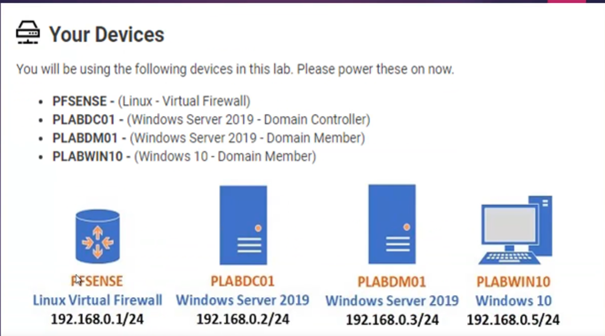

# Lab 3 - Zusätzliches HR-Netzwerk hinzufügen



## Ziel

Ein zusätzliches Netzwerk `HR` soll in Hyper-V und pfSense eingerichtet werden. PLABDM01 wird in das neue Netz verschoben und die Firewall-Regeln werden angepasst.

## Netzbereiche

| Netz | Zweck | IP-Bereich |
| --- | --- | --- |
| WAN | Externes Netz | `10.71.31.0/24` |
| LAN | Internes Basisnetz | `192.168.0.0/24` |
| HR | Neues internes Netz | `192.168.2.0/24` |

## pfSense Interfaces

| Interface | Adapter | IP-Adresse | Gateway |
| --- | --- | --- | --- |
| WAN | `hn0` | `10.71.31.2/24` | `10.71.31.254` |
| LAN | `hn1` | `192.168.0.1/24` | keines |
| HR | `hn2` | `192.168.2.1/24` | keines |

## Hyper-V vorbereiten

1. pfSense herunterfahren.
2. Im virtuellen Switch-Manager einen privaten Switch `HR` erstellen.
3. Der pfSense-VM einen zusätzlichen Netzwerkadapter mit dem Switch `HR` hinzufügen.
4. pfSense starten und das neue Interface zuweisen.

## pfSense im Webinterface konfigurieren

1. pfSense-Webinterface öffnen.
2. `Interfaces > OPT1` aufrufen.
3. Interface aktivieren und in `HR` umbenennen.
4. IPv4-Konfiguration statisch setzen:

```text
IP:    192.168.2.1
Maske: /24
```

## NAT-Regeln

Pfad: `Firewall > NAT > Outbound`

1. Modus auf `Hybrid Outbound NAT` setzen.
2. NAT-Regel für `LAN` erstellen:

```text
Interface:   WAN
Source:      192.168.0.0/24
Translation: WAN address
```

3. NAT-Regel für `HR` erstellen:

```text
Interface:   WAN
Source:      192.168.2.0/24
Translation: WAN address
```

## Firewall-Regeln

### LAN

Pfad: `Firewall > Rules > LAN`

- Action: `Pass`
- Protocol: `any`
- Source: `LAN subnets`
- Destination: `any`

### HR

Pfad: `Firewall > Rules > HR`

- Action: `Pass`
- Protocol: `any`
- Source: `HR subnets`
- Destination: `any`

## PLABDM01 verschieben

1. PLABDM01 herunterfahren.
2. Netzwerkadapter auf den Hyper-V-Switch `HR` umstellen.
3. VM starten.
4. IP-Konfiguration und Erreichbarkeit prüfen.

## Ergebnis

Das zusätzliche HR-Netz ist eingebunden. pfSense routet zwischen den Netzen und stellt über NAT den Internetzugang bereit.
