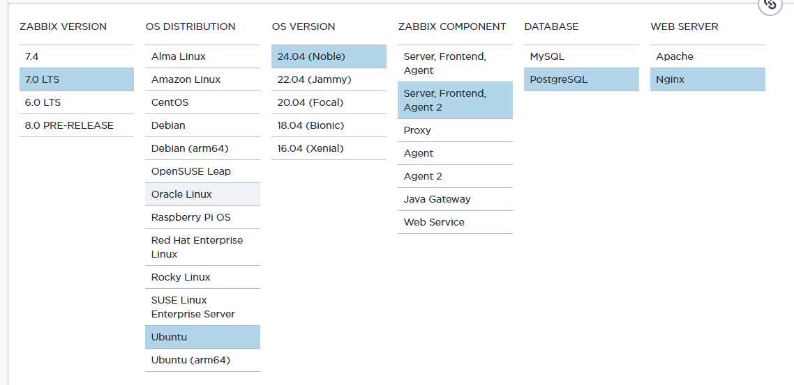
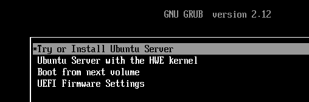
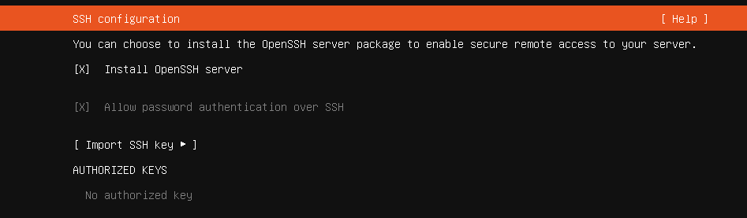
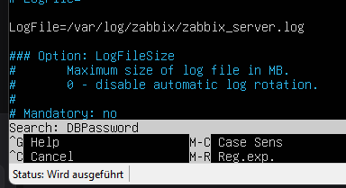
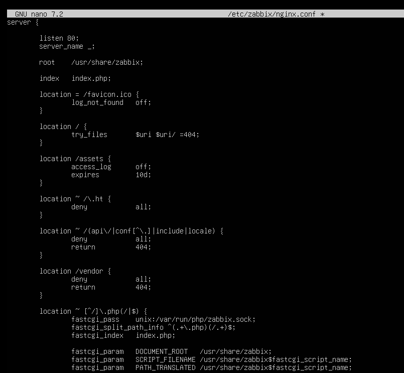
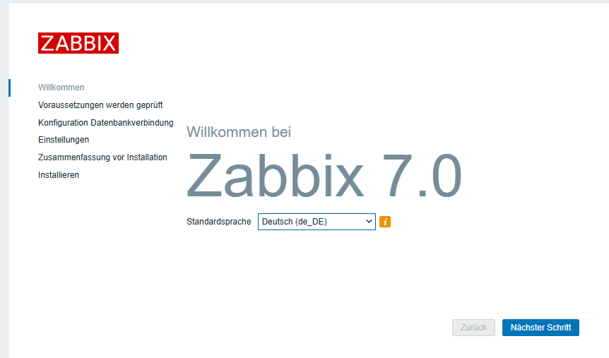
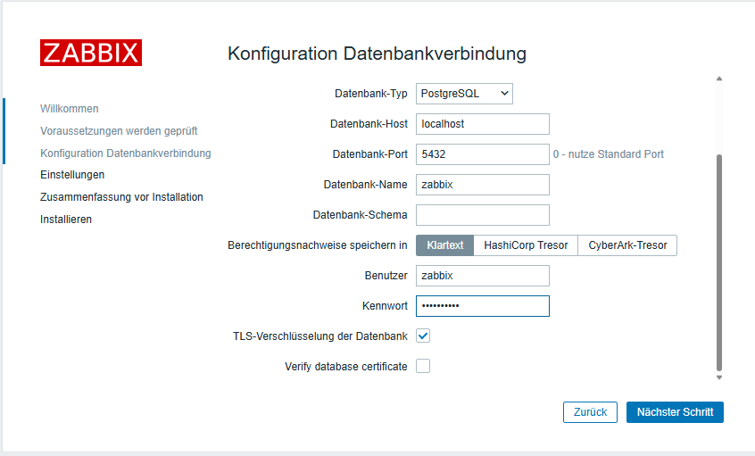
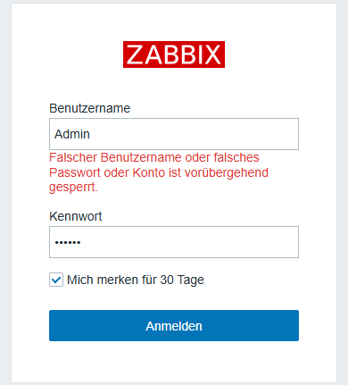
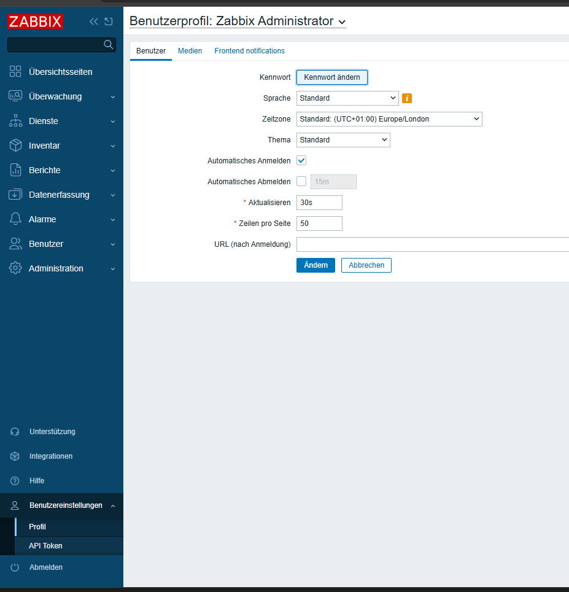

# Zabbix-Server installieren

Installation von Zabbix Server 7.0 LTS auf Ubuntu Server 24.04 LTS mit PostgreSQL, Nginx und Zabbix Agent 2.

## Gewünschte Einstellungen

- Zabbix-Version: `7.0 LTS`
- Betriebssystem: `Ubuntu 24.04 LTS`
- Komponenten: Server, Frontend und Agent 2
- Datenbank: PostgreSQL
- Webserver: Nginx



[Zabbix-Paketauswahl öffnen](https://www.zabbix.com/download?zabbix=7.0&os_distribution=ubuntu&os_version=24.04&components=server_frontend_agent_2&db=pgsql&ws=nginx)

[Ubuntu Server 24.04 LTS herunterladen](https://ubuntu.com/download/server/thank-you?version=24.04.4&architecture=amd64&lts=true)

## Ubuntu-Server vorbereiten

1. Ubuntu Server 24.04 LTS mit mindestens 2 CPUs, 4 GB RAM, 40 GB Speicher und einer statischen IP-Adresse bereitstellen.
2. Secure Boot deaktivieren und die Installation starten.



3. Sprache `Deutsch` auswählen und auf den neuesten Installer aktualisieren.
4. `Ubuntu Server` auswählen.
5. Zunächst eine IP-Adresse per DHCP zuweisen und die Standardeinstellungen verwenden.
6. Das Benutzerprofil anlegen:
   - Benutzername: `user`
   - Kennwort: `<SICHERES_UBUNTU_PASSWORT>`
7. `Install OpenSSH server` aktivieren.



8. Die weiteren Standardeinstellungen durchgehen und die Serverinstallation starten.
9. Nach der Installation den USB-Stick entfernen und `Reboot Now` auswählen.
10. Mit `user` und dem festgelegten Kennwort anmelden.

## System und Zabbix-Pakete installieren

System aktualisieren:

```bash
sudo apt update
```

Zabbix-Repository herunterladen und installieren:

```bash
wget https://repo.zabbix.com/zabbix/7.0/ubuntu/pool/main/z/zabbix-release/zabbix-release_latest_7.0+ubuntu24.04_all.deb
sudo dpkg -i ./zabbix-release_latest_7.0+ubuntu24.04_all.deb
sudo apt update
```

Bei einem Tippfehler den vorherigen Befehl mit der Pfeiltaste nach oben aufrufen und korrigieren.

Zabbix Server, Frontend, Agent 2, PostgreSQL und PHP-Unterstützung installieren:

```bash
sudo apt install -y zabbix-server-pgsql zabbix-nginx-conf zabbix-sql-scripts zabbix-agent2 postgresql php8.3-pgsql
```

## PostgreSQL-Datenbank erstellen

Datenbankbenutzer anlegen:

```bash
sudo -u postgres createuser --pwprompt zabbix
```

Als Kennwort `<SICHERES_DATENBANKPASSWORT>` vergeben.

Datenbank erstellen:

```bash
sudo -u postgres createdb -O zabbix zabbix
```

Pfad zum Datenbankschema prüfen:

```bash
sudo find /usr/share -name "server.sql.gz"
```

Datenbankschema importieren:

```bash
zcat /usr/share/zabbix-sql-scripts/postgresql/server.sql.gz | sudo -u zabbix psql zabbix
```

## Zabbix-Server konfigurieren

Konfiguration öffnen:

```bash
sudo nano /etc/zabbix/zabbix_server.conf
```

1. Mit `Strg + W` nach `DBPassword` suchen.



2. Folgenden Wert setzen:

```text
DBPassword=<SICHERES_DATENBANKPASSWORT>
```

3. Mit `Strg + O`, `Enter` und `Strg + X` speichern und schließen.

## Nginx konfigurieren

Konfiguration öffnen:

```bash
sudo nano /etc/zabbix/nginx.conf
```

Folgende auskommentierte Werte:

```nginx
# listen 8080;
# server_name example.com;
```

durch diese Werte ersetzen:

```nginx
listen 80;
server_name _;
```



Mit `Strg + O`, `Enter` und `Strg + X` speichern und schließen. Die Konfiguration auf Fehler prüfen, bevor die nächsten Schritte ausgeführt werden.

## Dienste starten und aktivieren

```bash
sudo systemctl restart zabbix-server zabbix-agent2 nginx php8.3-fpm
sudo systemctl enable zabbix-server zabbix-agent2 nginx php8.3-fpm
```

Status von Zabbix Server und Nginx prüfen:

```bash
sudo systemctl status zabbix-server --no-pager
sudo systemctl status nginx --no-pager
```

Nginx-Standardseite entfernen:

```bash
sudo rm /etc/nginx/sites-enabled/default
```

IP-Adresse anzeigen:

```bash
ip a
```

## Webinstallation abschließen

1. `http://<ZABBIX_SERVER_IP>` im Browser öffnen.
2. Im Zabbix-Webinstaller die Sprache auswählen.



3. Für die Datenbankverbindung folgende Werte verwenden:
   - Datenbank-Typ: `PostgreSQL`
   - Datenbank-Host: `localhost`
   - Datenbank-Port: `5432`
   - Datenbank-Name: `zabbix`
   - Benutzer: `zabbix`
   - Kennwort: `<SICHERES_DATENBANKPASSWORT>`



4. Auf der nächsten Seite die Zeitzone `Europe/Berlin` auswählen.
5. Bei Bedarf einen Namen für den Zabbix-Server vergeben. Dieser kann später im Profil geändert werden.
6. Die Installation abschließen.
7. Mit den Standarddaten anmelden:
   - Benutzername: `Admin`
   - Kennwort: `zabbix`



8. Direkt danach unter `Benutzereinstellungen > Profil` das Standardkennwort in `<SICHERES_ZABBIX_ADMINPASSWORT>` ändern.



## Zeitzone einstellen

Aktuelle Zeitzone prüfen:

```bash
timedatectl
```

Zeitzone auf Europe/Berlin setzen:

```bash
sudo timedatectl set-timezone Europe/Berlin
```

## Firewall vorbereiten

Firewall aktivieren und benötigte Ports freigeben:

```bash
sudo ufw enable
sudo ufw allow 22/tcp
sudo ufw allow 80/tcp
sudo ufw allow 10051/tcp
sudo ufw allow 443/tcp
sudo ufw status
```

Port `443/tcp` ist für eine spätere HTTPS-Bereitstellung über ein Zertifikat beziehungsweise einen Reverse Proxy vorgesehen.
