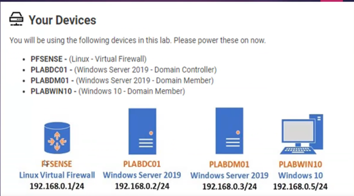
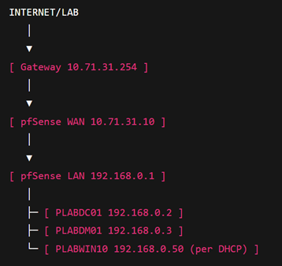

# Lab 1 - Windows-Testumgebung mit pfSense-Firewall

## Ziel

Virtuelle Testumgebung mit pfSense, Windows Server, Active Directory, DHCP und Windows-11-Client.

## Umgebung

| System | Rolle | IP-Adresse |
| --- | --- | --- |
| pfSense | Firewall und Gateway | WAN: `10.71.31.10`, LAN: `192.168.0.1` |
| PLABDC01 | Domain Controller, DNS, DHCP | `192.168.0.2` |
| PLABDM01 | Member Server | `192.168.0.3` |
| PLABWIN11 | Windows-11-Client | DHCP |

## Aufbau

## Wichtige Konfiguration

- pfSense in Hyper-V mit getrenntem WAN- und LAN-Adapter betreiben.
- Secure Boot für pfSense deaktivieren.
- LAN-Switch als privates internes Netz verwenden.
- WAN statisch setzen: `10.71.31.10/24`, Gateway `10.71.31.254`.
- LAN statisch setzen: `192.168.0.1/24`, kein Gateway auf LAN.
- Auf `PLABDC01` DNS auf sich selbst setzen: `192.168.0.2`.
- DHCP auf `PLABDC01` bereitstellen.
- Member Server und Client der Domäne `Plab.de` beitreten lassen.

## Firewall-Regel

Pfad: `Firewall > Rules > LAN > Add`

| Feld | Wert |
| --- | --- |
| Action | Pass |
| Interface | LAN |
| Protocol | any |
| Source | LAN net `192.168.0.0/24` |
| Destination | any |

## Worauf man achten muss

- Gateway nur dort setzen, wo es fachlich gebraucht wird.
- DNS der Domänenmitglieder muss auf den Domain Controller zeigen.
- pfSense-Gateway unter `System > Routing > Gateways` prüfen.
- Firewall-Regeln bewusst setzen und danach testen.
- DHCP erst prüfen, bevor der Client der Domäne beitritt.

## Ergebnis

LAN, Domain Controller, DHCP und Client laufen hinter pfSense in einer reproduzierbaren Testumgebung.
